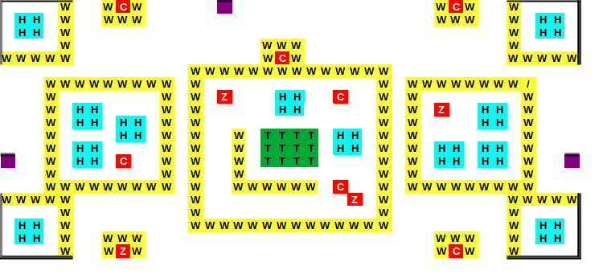

# Clash-of-Clans-Terminal-Version

## HOW TO PLAY

### Start

`python3 game.py`

### Troops

- 1 King or 1 Queen
- 5 Barbarian
- 5 Archer
- 3 Balloon

### Moves

#### Spawn Keys

| Troop Name | Spawn 1 (0,12)  | Spawn (15,0)  | Spawn 3 (39,12) |
| ---------- | -------- | -------- | -------- |
| **King**       | `J`      | `K`      | `L`      |
| **Queen**      | `J`      | `K`      | `L`      |
| **Barbarian**  | `I`      | `O`      | `P`      |
| **Archer**     | `T`      | `Y`      | `U`      |
| **Balloon**    | `Z`      | `X`      | `C`      |

#### Movement Keys

| Troop Name     | UP       | DOWN     | LEFT     | RIGHT     |
| -------------- | -------- | -------- | -------- |  -------- |
| **King**       | `W`      | `A`      | `S`      | `D`       |
| **Queen**      | `W`      | `A`      | `S`      | `D`       |

#### Attack Keys

| Troop Name     | Attack   |
| -------------- | -------- |
| **King**       | `SpaceBar` |
| **Queen**      | `SpaceBar` |

#### Spells

- `m` Double movement speed and attack power for all troops 12 Timeperiod
- `n` 1.5 Times health for all troops

## Maps


<!-- 
#### King Spawning

- `k` Spawn king in (0,13)
- `j` Spawn king in (12,0)
- `l` Spawn king in (29,12)

#### King Movement

- `w` Move up
- `s` Move down
- `a` Move left
- `d` Move right

#### king attack

- `SpaceBar` Attack

#### Barbarian Spawning

- `o` Spawn Barbarian in (0,13)
- `i` Spawn Barbarian in (12,0)
- `p` Spawn Barbarian in (29,12)
 -->

## REPLAY

- `python3 replay.py <file_name from ./replays>`

### OOPS concepts

#### Inheritance

- Inheritance is a way to create a new class from an existing class.
- Inheritance used in the project is in './src/attackers/'

```python3

class attackers:
    .
    .
    .
class king(attackers):
    .
    .
    .
```

#### Polymorphism

- Polymorphism is the ability of an object/function to take on many forms.

- Example : There is universal display() function for `attackers` ,but it can be overriden by `Barbarian` display() function, when called for Barbarian.

#### Encapsulation

- Encapsulation is having classes objects
- Example , `Kings` and `Barbarians` are classes

#### Abstraction

- Classes having their function
- `King` has `attack()` function
